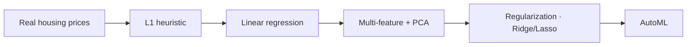

# 📚 Seoul Apartment Price Prediction - ML Roadmap

[](https://bookseal-seoul-apt-price-prediction.streamlit.app)

A step-by-step guide to learning machine learning through apartment price prediction in Seoul. This project takes you from basic heuristics to advanced AutoML in 10 progressive levels.

## 🚀 Quick Start

### 1. Install Dependencies
```bash
pip install -r requirements.txt
```

### 2. Run the App
```bash
streamlit run app.py
```
Open your browser to the URL shown in the terminal.

## 🗺️ Learning Levels

This project is divided into 10 levels, each introducing new concepts:



| Level | Topic | Description |
|-------|-------|-------------|
| **1** | **Heuristic** | Simple prediction using median price per district (No ML). |
| **2** | **Linear Regression** | First ML model using a single feature (Area). |
| **3** | **Multi-Features** | Improving the model with multiple features and encoding. |
| **4** | **3D Regression** | Visualizing data in 3D and adding 'Year' as a feature. |
| **5** | **High-Dimensional** | Handling 10+ features and understanding complexity. |
| **6** | **PCA** | Reducing dimensionality to understand data structure. |
| **7** | **Data Cleaning** | Handling missing values and outliers for better quality. |
| **8** | **Feature Engineering** | creating new features to boost model performance. |
| **9** | **Regularization** | Using Ridge/Lasso to prevent overfitting. |
| **10** | **AutoML** | The finale: Automatic model selection and tuning. |

## 🛠️ Tech Stack

- **App Framework**: Streamlit
- **Machine Learning**: scikit-learn
- **Data Processing**: Pandas, NumPy
- **Visualization**: Plotly, Matplotlib

## 📂 Project Structure

- `app.py`: Main entry point for the Streamlit app.
- `pages/`: Code for each of the 10 learning levels.
- `src/`: Utility functions for data loading, processing, and visualization.
- `data/`: Dataset storage (parquet format).
- `models/`: Directory for saving trained models.

## 🤝 Contributing

This is an educational project. Feel free to explore, experiment, and submit PRs for improvements!
