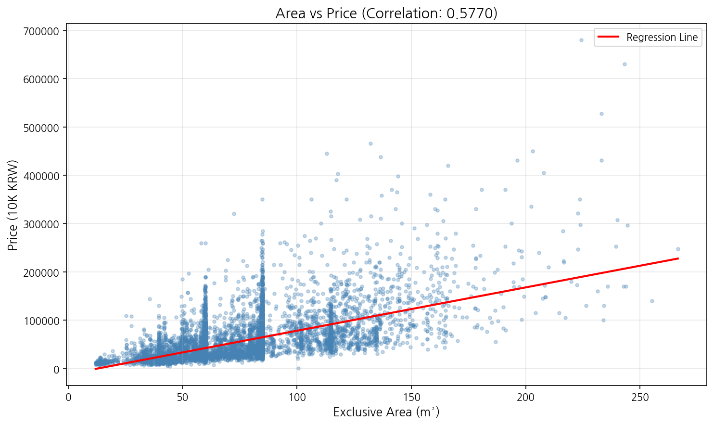

# Level 2 Linear Regression Training Results

**Date**: 2026-01-09
**Model**: Simple Linear Regression (Area only)

## Training Configuration

- **Feature**: 전용면적(㎡) (Exclusive Area)
- **Target**: 거래금액(만원) (Transaction Price in 10K KRW)
- **Test Size**: 20%
- **Random State**: 42

## Data

| Metric | Value |
|--------|-------|
| Total Samples | 1,118,822 |
| Training Set | 895,057 |
| Validation Set | 223,765 |

## Model Parameters

```
Price = 909.97 × Area - 12,227.54
```

| Parameter | Value |
|-----------|-------|
| Coefficient (w) | 909.97 |
| Intercept (b) | -12,227.54 |

### Interpretation
- **+1m² area → +910 (10K KRW) = +9.1M KRW**
- Example: 84m² apartment → 909.97 × 84 - 12,227 = **64,210 (10K KRW) ≈ 6.4억원**

## Performance

| Metric | Value |
|--------|-------|
| RMSE | 37,942.53 |
| Mean Price | 57,944.53 |
| RMSE / Mean | 65.48% |

## Visualization



## How to Reproduce

```bash
cd seoul-apt-price-prediction
python train.py
```

## Files Generated

- `models/linear_area_model.pkl` - Trained model
- `output/figures/correlation_scatter.png` - Scatter plot
